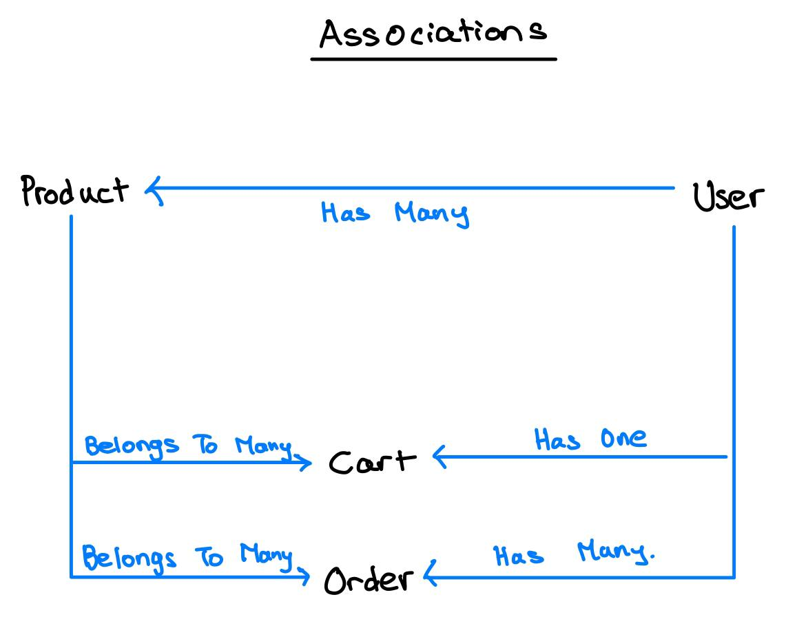

# SQL (Storing Data in Databases)

## Objectives

- Different kinds of databases (SQL vs NoSQL)
- Using SQL in a Node.js App

## Choosing a Database

- Goal: Store Data and Make it Easily Accessible
- Use a Database
  - Quicker Access than with a File

## SQL

- SQL Database
  - Data Schema
  - Data Relations (Tables are connected)
    - One-to-One
    - One-to-Many
    - Many-to-Many
  - Tables with fields/columns
  - E.g., MySQL

## NoSQL

- Does not have a schema
- No structure required
- No data relations
- Store documents (objects) inside collections
  - {name: 'Max', age: 29}
- NoSQL Database e.g., MongoDB

## Horizontal Scaling vs Vertical Scaling

|                 Horizontal Scaling                 |          Vertical Scaling          |
| :------------------------------------------------: | :--------------------------------: |
| Add More Servers (and merge Data into one Database | Improve Server Capacity / Hardware |

## SQL vs NoSQL

|                                      SQL                                       |                        NoSQL                         |
| :----------------------------------------------------------------------------: | :--------------------------------------------------: |
|                               Data uses Schemas                                |                     Schema-less                      |
|                                   Relations                                    |              No (or very few) Relations              |
|                   Data is distributed across multiple tables                   | Data is typically merged/nested in a few collections |
| Horizontal Scaling is difficult / impossible <br> Vertical scaling is possible |   Both horizontal and vertical scaling is possible   |
|    Limitations for lots of (thousands) read <br> & write queries per second    |  Great performance for mass read & write requests.   |

---

## MySQL

- `const mysql = require("mysql2")`
- `mysql.createPool` allows us to run multiple connections unlike `mysql.createConnection`.
  - Can run multiple queries simultaneously because each query requires a connection.

---

### `mysql.createConnection`

- When you create a connection with mysql.createConnection, you only have one connection and it lasts until you close it OR connection closed by MySQL.
- A single connection is blocking.
- While executing one query, it cannot execute others. hence, your application will not perform good.

### `mysql.createPool`

- mysql.createPool is a place where connections get stored.
- When you request a connection from a pool,you will receive a connection that is not currently being used, or a new connection.
- If you're already at the connection limit, it will wait until a connection is available before it continues.
- A pool while one connection is busy running a query, others can be used to execute subsequent queries.
- Hence, your application will perform good.

```js
const mysql = require("mysql2");

const pool = mysql.createPool({
  host: "localhost",
  user: "root",
  database: "node-complete",
  password: "password",
});

module.exports = pool.promise();
```

- Inside the class to call `db.execute`

```js
  save() {
    return db.execute(
      "INSERT INTO products (title, price, imageUrl, description) VALUES (?,?,?,?)",
      [this.title, this.price, this.imageUrl, this.description]
    );
  }
```

- Use `pool.promise()` to return a promise when calling `mysql.createPool`.

---

# Sequelize

- Have to install both
  - `npm install --save mysql2`
  - `npm install --save sequelize`

## What is Sequelize?

- An Object-Relational Mapping Library
- Models
  - e.g., User, Product
- Instances
  - `const user = User.build()`
- Queries
  - `User.findAll()`
- Associations
  - `User.hasMany(Product)`

## Setting up Sequelize

- In `database.js`

```js
const { Sequelize } = require("sequelize");

const sequelize = new Sequelize("node-complete", "root", "password", {
  dialect: "mysql",
  host: "localhost",
});

module.exports = sequelize;
```

- Inside `models` folder and in `product.js`, the table products can be created by writing the following sequelize script.
- Use `DataTypes` to define the types of the columns in the Table.

```js
const Sequelize = require("sequelize");
const { DataTypes } = require("sequelize"); //Import DataTypes instead.

const sequelize = require("../util/database");

const Product = sequelize.define("product", {
  id: {
    type: DataTypes.INTEGER,
    autoIncrement: true,
    allowNull: false,
    primaryKey: true,
  },
  title: DataTypes.STRING,
  price: {
    type: DataTypes.DOUBLE,
    allowNull: false,
  },
  imageUrl: {
    type: DataTypes.STRING,
    allowNull: false,
  },
  description: {
    type: DataTypes.STRING,
    allowNull: false,
  },
});

module.exports = Product;
```

- In `app.js`

```js
sequelize
  .sync()
  .then((result) => {
    // console.log(result);
    console.log("Connected to MySQL Database using Sequelize");
  })
  .catch((err) => {
    console.log(err);
  });
```

## Associations



## Sequelize Queries

- `Product.findAll()`
- `Product.findByPk()`
- `Product.create()`
- `product.save()`
  - Updating after finding the product by primary key
  - Used 2 promises and didn't nest the promise that is in `product.save()` by returning it and creating another `.then()`
  - the `catch(err)` catches error in both promises.

```js
Product.findByPk(prodId)
  .then((product) => {
    product.title = updatedTitle;
    product.price = updatedPrice;
    product.description = updatedDesc;
    product.imageUrl = updatedImageUrl;
    return product.save();
  })
  .then((result) => {
    // this promise is linked to product.save()
    console.log("UPDATED PRODUCT!");
    res.redirect("/admin/products");
  })
  .catch((err) => console.log(err));
```

- `product.destroy()`: used to delete the product
  - same as before, can also do `Product.findByPk()` first before deleting the product by `product.destroy()`.

---

- Setting up relationships between tables in Sequelize

```js
// onDelete: if user is deleted, product is deleted
Product.belongsTo(User, { constraints: true, onDelete: "CASCADE" });
User.hasMany(Product); // one user has many products
```

## `req.user`

- Returning a sequelize object by using `req.user` which is associated to the specific id of the user.

```js
app.use((req, res, next) => {
  User.findByPk(1)
    .then((user) => {
      // storing user retrieved from database (it is a sequelize object)
      req.user = user;
      next();
    })
    .catch((err) => console.log(err));
});
```

## Sequelize `belongsToMany` method

- [Sequelize belongsToMany](https://sequelize.org/api/v6/class/src/associations/belongs-to-many.js~belongstomany)
- In Sequelize when you create any association between two models, sequelize provides us with some methods. For example in case of User.hasMany(Order) association sequelize provides us with:
  1. add
  2. count
  3. create
  4. get
  5. has
  6. remove
  7. set
- In `admin.js` controller, can use `req.user.createProduct` which is a method from `belongsToMany`.
- It automatically tags the UserId to the created product.

```js
req.user
    .createProduct({
      title: title,
      price: price,
      imageUrl: imageUrl,
      description: description,
    })
    .then(...
```

- Can get products based on the `req.user.getProducts` method which gets the specific product based on userId
- The `getProducts` method returns an array of 1 element.
  - Thus, need to do something like `const product = products[0]`

```js
req.user
  .getProducts({ where: { id: prodId } })
  // Product.findByPk(prodId)
  .then((products) => {
    // have to use this array otherwise sequelize looks for
    // WHERE userId = 1 AND id = 1 because we use `getProducts()` method
    const product = products[0];
    if (!product) {
      return res.redirect("/");
    }
    res.render("admin/edit-product", {
      pageTitle: "Edit Product",
      path: "/admin/edit-product",
      editing: editMode,
      product: product,
    });
  })
  .catch((err) => console.log(err));
```

- Nested queries in sequelize

```js
exports.getCart = (req, res, next) => {
  req.user
    .getCart()
    .then((cart) => {
      return cart
        .getProducts()
        .then((products) => {
          res.render("shop/cart", {
            path: "/cart",
            pageTitle: "Your Cart",
            products: products,
          });
        })
        .catch((err) => console.log(err));
    })
    .catch((err) => console.log(err));
};

exports.postCart = (req, res, next) => {
  const prodId = req.body.productId;
  let fetchedCart;
  let newQuantity = 1;
  req.user
    .getCart()
    .then((cart) => {
      fetchedCart = cart;
      return cart.getProducts({ where: { id: prodId } });
    })
    .then((products) => {
      // return an array of 1 element
      let product;
      if (products.length > 0) {
        product = products[0];
      }
      // adding a product to the cart (existing product, increment quantity)
      if (product) {
        const oldQuantity = product.cartItem.quantity;
        newQuantity = oldQuantity + 1;
        return product;
      }
      return Product.findByPk(prodId);
    })
    .then((product) => {
      return fetchedCart.addProduct(product, {
        through: { quantity: newQuantity },
      });
    })
    .then(() => {
      res.redirect("/cart");
    })
    .catch((err) => console.log(err));
};
```

## `includes`

```js
exports.getOrders = (req, res, next) => {
  req.user
  // each order now has a product array
  // the orders does not have a orderItem key
    .getOrders({include: ['products']})
    .then((orders) => {
      res.render("shop/orders", {
        path: "/orders",
        pageTitle: "Your Orders",
        orders: orders,
      });
    })
    .catch((err) => console.log(err));
};
```